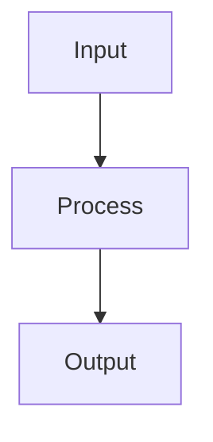

# Task Plan: {{PROJECT_NAME}}

**Created**: {{YYYY-MM-DD}}
**Status**: Draft | In Progress | Blocked | Completed
**Last Updated**: {{YYYY-MM-DD HH:MM}}

## Summary
[One-paragraph overview of what we're building and why]

## Skill Sequence (The Playbook)

> This section lists the skills that will be used to execute this plan deterministically.

| Step | Skill | Purpose | Input | Output | Status |
|------|-------|---------|-------|--------|--------|
| 1 | front-door | Interview/triage | User request | requirements.yaml | ⏸️ Pending |
| 2 | [skill-name] | [purpose] | [from previous] | [produces] | ⏸️ Pending |
| 3 | [skill-name] | [purpose] | [from previous] | [produces] | ⏸️ Pending |
| 4 | implement-plan | Execute skills deterministically | All above | Completed project | ⏸️ Pending |

**Skill Inventory Check:**
- Run: `python3 ~/.claude/skills/skill_discovery.py "[GOAL]"`
- Add discovered skills to this sequence

## Problem Statement
[What problem this solves, who has it, and why it matters]

## Goals
- [ ] Goal 1 - [Specific, measurable outcome]
- [ ] Goal 2 - [Specific, measurable outcome]
- [ ] Goal 3 - [Specific, measurable outcome]

## Non-Goals
- What this will NOT do (explicit scope limits)
- Features explicitly out of scope
- Problems we're NOT solving

## Decisions
| # | Question | Options | Decision | Rationale |
|---|----------|---------|----------|-----------|
| 1 | [Technical question] | A, B, C | _pending_ | [Why we chose X] |
| 2 | [Architecture choice] | Option X, Option Y | _pending_ | [Trade-off analysis] |

## Technical Approach

### Architecture
[High-level architecture diagram or description]

### Key Components
1. **Component 1**: Description and purpose
2. **Component 2**: Description and purpose
3. **Component 3**: Description and purpose

### Data Flow
[How data moves through the system - can use text or Mermaid]

## Implementation Phases

### Phase 1: [Name] (Status: pending)
**Goal**: [What this phase achieves]
- [ ] Step 1.1: [Specific action]
- [ ] Step 1.2: [Specific action]
- [ ] Step 1.3: [Specific action]

### Phase 2: [Name] (Status: pending)
**Goal**: [What this phase achieves]
**Dependencies**: Phase 1 complete
- [ ] Step 2.1: [Specific action]
- [ ] Step 2.2: [Specific action]

### Phase 3: [Name] (Status: pending)
**Goal**: [What this phase achieves]
**Dependencies**: Phase 2 complete
- [ ] Step 3.1: [Specific action]

## Dependencies
- [External dependency 1] - [Where to get it]
- [External dependency 2] - [Version requirements]
- [Internal dependency] - [What must exist first]

## Risks & Mitigations
| Risk | Likelihood | Impact | Mitigation |
|------|------------|--------|------------|
| [Risk description] | Low/Med/High | Low/Med/High | [Strategy to avoid or handle] |
| [Risk description] | Low/Med/High | Low/Med/High | [Strategy to avoid or handle] |

## Success Metrics
- [Metric 1]: [Target value] - [How to measure]
- [Metric 2]: [Target value] - [How to measure]
- [Metric 3]: [Target value] - [How to measure]

## Beads Integration
- **Epic ID**: `bd-xxxx` (created during implementation)
- **Phase Tasks**: Each phase synced to beads for tracking

## MCP Tools Available
- **Vision MCP**: ui_to_artifact, diagnose_error_screenshot, understand_technical_diagram
- **Web Search MCP**: webSearchPrime for real-time research
- **Zread MCP**: search_doc, get_repo_structure, read_file for GitHub repos

---
## Revision History
| Date | Changed By | Summary |
|------|------------|---------|
| YYYY-MM-DD | [Agent/User] | Initial plan |
| YYYY-MM-DD | [Agent/User] | [Change summary] |
